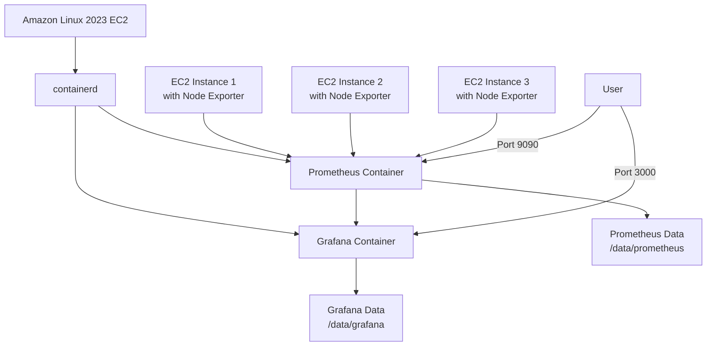
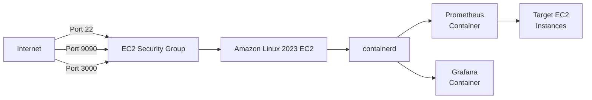

# Prometheus and Grafana Deployment on Amazon Linux 2023 with containerd

This repository contains the architecture design and deployment scripts for setting up Prometheus and Grafana monitoring on Amazon Linux 2023 EC2 instances using containerd.

## Architecture Overview

This solution deploys Prometheus and Grafana containers using containerd on an Amazon Linux 2023 EC2 instance. The setup includes:

- Prometheus for metrics collection and storage
- Grafana for metrics visualization and dashboarding
- Node Exporter for collecting system metrics from EC2 instances
- Authentication for both Prometheus and Grafana
- Persistent storage for metrics data and dashboards

### Architecture Diagram



### Network Architecture



## Deployment Components

### 1. Infrastructure Setup

#### 1.1 EC2 Instance Provisioning
- Amazon Linux 2023 EC2 instance (t3.medium or larger recommended)
- At least 20GB EBS storage for the OS and container images
- Additional EBS volume(s) for persistent storage (recommended 50GB+)
- Security group with inbound rules for:
  - SSH (port 22)
  - Prometheus (port 9090)
  - Grafana (port 3000)

#### 1.2 Storage Configuration
- Additional EBS volume mounted for persistent storage
- Directories for Prometheus and Grafana data:
  ```
  /data/prometheus
  /data/grafana
  ```

### 2. containerd Setup and Configuration

- Installation of containerd and related tools
- Configuration for production use
- Network configuration for container communication
- Port mapping for Prometheus and Grafana

### 3. Prometheus Deployment

#### 3.1 Prometheus Configuration
- `prometheus.yml` configuration with:
  - Scrape configurations for EC2 instances
  - Retention settings
  - Alert manager configuration (optional)

#### 3.2 Prometheus Container Deployment
- Persistent volume mapping to `/data/prometheus`
- Port mapping (9090:9090)
- Resource limits
- Restart policy

#### 3.3 Node Exporter Deployment
- Node exporter containers on target EC2 instances
- Prometheus configuration to scrape metrics

### 4. Grafana Deployment

#### 4.1 Grafana Configuration
- Authentication settings
- Database configuration
- Plugin settings (if needed)

#### 4.2 Grafana Container Deployment
- Persistent volume mapping to `/data/grafana`
- Port mapping (3000:3000)
- Resource limits
- Restart policy

#### 4.3 Grafana Initial Setup
- Prometheus data source configuration
- Basic dashboards for EC2 monitoring
- Custom dashboards for specific metrics

## Authentication Implementation

### 1. Prometheus Authentication

Since Prometheus doesn't have built-in authentication in its core functionality, we implement authentication using a reverse proxy:

#### Nginx Reverse Proxy Authentication
- Nginx installed as a reverse proxy in front of Prometheus
- Basic authentication configured:
  ```nginx
  server {
      listen 9090;
      
      location / {
          auth_basic "Prometheus";
          auth_basic_user_file /etc/nginx/.htpasswd;
          
          proxy_pass http://localhost:9091;  # Prometheus running on internal port
          proxy_set_header Host $host;
      }
  }
  ```
- Password file created using htpasswd
- Prometheus runs on an internal port (9091) not exposed externally
- Only the Nginx proxy is exposed on port 9090

### 2. Grafana Authentication

Grafana has built-in authentication:

#### 2.1 Initial Admin User Setup
- Admin user configured using environment variables with default credentials:
  ```
  GF_SECURITY_ADMIN_USER=admin
  GF_SECURITY_ADMIN_PASSWORD=admin
  ```
- Users are prompted to change the password on first login
- This approach ensures a clean and reliable authentication setup

#### 2.2 Authentication Configuration
- Authentication uses Grafana's default settings
- The deployment script uses a minimal configuration approach
- This avoids potential conflicts between configuration file settings and environment variables

#### 2.3 User Management
- Additional users created through Grafana UI
- Appropriate permissions using Grafana's role-based access control
- Password policy configured

## Security Best Practices

- Strong, unique passwords for both services
- Regular credential rotation
- IP-based restrictions in addition to password authentication
- HTTPS/TLS for all communications
- Secure credential storage (not in plain text configuration files)
- Environment variables for sensitive information
- Proper logging for authentication attempts

## Scripts Included

This repository includes several scripts to help you deploy, manage, and maintain your Prometheus and Grafana monitoring environment:

### Main Deployment Script

- **deploy.sh**: The primary deployment script that sets up containerd, Prometheus, Grafana, and Node Exporter on the main EC2 instance. It configures authentication, persistent storage, and basic dashboards.

### Additional Utility Scripts

- **deploy_node_exporter.sh**: Deploys Node Exporter on target EC2 instances that you want to monitor. This script installs Node Exporter as a systemd service and provides instructions for adding the instance to your Prometheus configuration.

- **update_monitoring.sh**: Updates your Prometheus and Grafana containers to the latest versions. This script backs up your data, pulls the latest container images, and recreates the containers with the same configuration.

- **backup_monitoring.sh**: Creates comprehensive backups of your Prometheus and Grafana data and configurations. Features include:
  - Configurable backup location
  - Backup rotation/retention
  - Optional compression
  - Detailed restore instructions

- **setup_backup_cron.sh**: Sets up automated backups using cron. Features include:
  - Customizable backup schedule
  - Configurable backup parameters
  - Easy installation and management of cron jobs

- **test_monitoring.sh**: Tests your Prometheus and Grafana setup to ensure everything is working correctly. Features include:
  - Service status verification
  - API endpoint testing
  - Authentication verification
  - Storage validation
  - Comprehensive system summary

- **uninstall_monitoring.sh**: Safely removes the Prometheus and Grafana monitoring system. Features include:
  - Automatic backup before removal
  - Optional data preservation
  - Optional configuration preservation
  - Complete cleanup of containers and services

## Deployment

To deploy this solution:

1. Launch an Amazon Linux 2023 EC2 instance with appropriate security groups
2. Clone this repository
3. Make the scripts executable:
   ```bash
   chmod +x *.sh
   ```
4. Run the main deployment script:
   ```bash
   sudo ./deploy.sh
   ```
5. To add monitoring for additional EC2 instances:
   - Copy `deploy_node_exporter.sh` to each target instance
   - Run the script on each instance:
     ```bash
     sudo ./deploy_node_exporter.sh
     ```
   - Follow the instructions to update your Prometheus configuration

For detailed deployment instructions, see the [DEPLOYMENT_GUIDE.md](DEPLOYMENT_GUIDE.md) file.

## Maintenance and Operations

### Backup Procedures

Use the included backup script to create regular backups:

```bash
# Basic backup with default settings
sudo ./backup_monitoring.sh

# Backup with custom settings
sudo ./backup_monitoring.sh --directory /path/to/backups --retention 14
```

The script creates comprehensive backups of:
- Prometheus data
- Grafana data
- All configuration files
- Nginx configuration

#### Automated Backups

Set up automated backups using the cron setup script:

```bash
# Set up daily backups at 2:00 AM (default)
sudo ./setup_backup_cron.sh

# Set up weekly backups on Sunday at 1:00 AM
sudo ./setup_backup_cron.sh --time "0 1 * * 0" --retention 4

# Set up backups every 6 hours with custom directory
sudo ./setup_backup_cron.sh --time "0 */6 * * *" --directory /mnt/backups
```

### Update Strategy

Use the included update script to update your monitoring stack:

```bash
sudo ./update_monitoring.sh
```

This script:
1. Creates backups of your current data
2. Pulls the latest container images
3. Recreates the containers with your existing configuration
4. Restarts all services

### Maintenance Best Practices

- Schedule regular backups using cron
- Update containers monthly or when security updates are released
- Regularly review and rotate credentials
- Monitor the monitoring system itself

## Troubleshooting

### Testing Your Monitoring System

Use the included test script to verify your monitoring system is working correctly:

```bash
sudo ./test_monitoring.sh
```

This script will:
- Check if all required services are running
- Verify that Prometheus is collecting metrics
- Test API endpoints for both Prometheus and Grafana
- Verify authentication is configured correctly
- Check persistent storage configuration
- Provide a comprehensive system summary

### Common Issues

For detailed troubleshooting information and solutions to common issues, see the troubleshooting section of the [DEPLOYMENT_GUIDE.md](DEPLOYMENT_GUIDE.md) file.

## Uninstallation

If you need to remove the monitoring system, use the included uninstall script:

```bash
# Basic uninstall (preserves data and configuration)
sudo ./uninstall_monitoring.sh

# Complete removal including data
sudo ./uninstall_monitoring.sh --remove-data --remove-configs

# Uninstall without creating a backup
sudo ./uninstall_monitoring.sh --no-backup
```

The uninstall script will:
1. Create a backup before removal (unless --no-backup is specified)
2. Stop and remove all containers
3. Remove container images
4. Stop and disable services
5. Remove data directories (if --remove-data is specified)
6. Remove configuration files (if --remove-configs is specified)

After uninstallation, you can manually remove the installed packages if desired:
```bash
sudo dnf remove -y containerd nginx
```